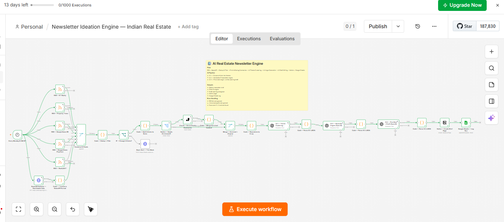
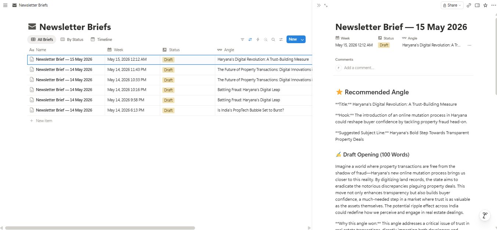
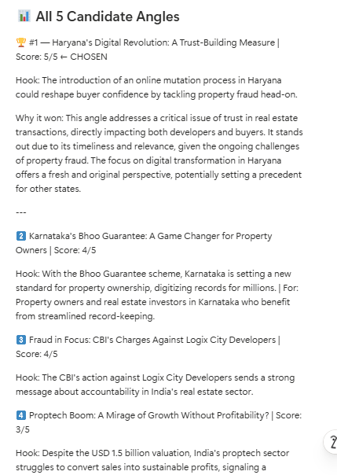
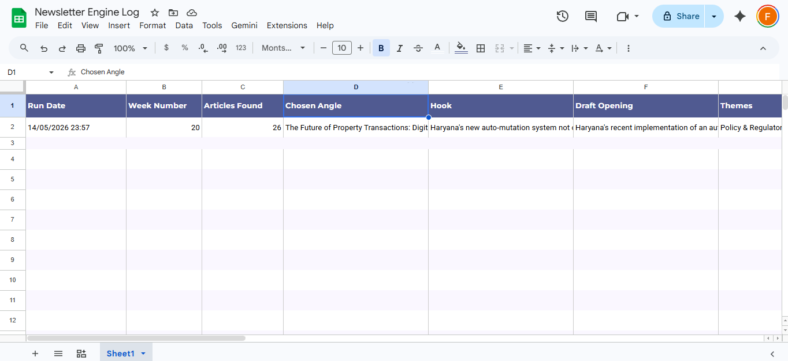
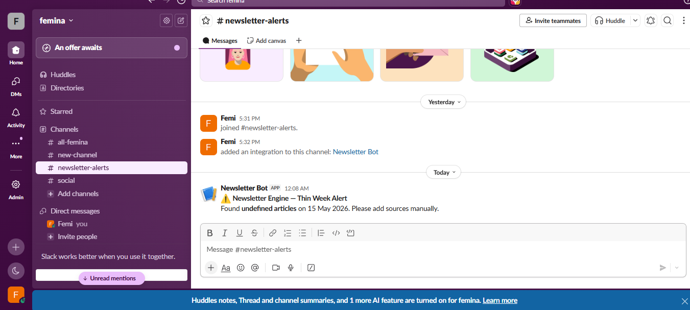

# Newsletter Ideation Engine — Indian Real Estate

**Femina K · May 2026 · Problem C · Funnel Truffle Marketing Automation Assignment**

Built on n8n. Runs every Monday 8 AM IST. Pulls from 6 news sources, runs 3 sequential AI calls, and drops a complete editorial brief into Notion — chosen angle, hook, subject line, 100-word draft opening, and all 5 candidate angles with scores. No manual work. Writer opens Notion, brief is already there.



---

## Links

| | |
|---|---|
| 🎥 **Loom Walkthrough** | [Newsletter Ideation Engine — Indian Real Estate -by Femina ->](https://youtu.be/NhjIHx39zqU?si=P7Yr7PZ33dLOe9TQ) |
| 📋 **Notion Database** | [Newsletter Briefs →](https://www.notion.so/coherent-duo/360b428fb07580ba9637f7f59d2d32d9?v=360b428fb07580519d41000cf41549a8) |
| 📊 **Google Sheets Log** | [Newsletter Engine Log →](https://docs.google.com/spreadsheets/d/1eyMBjMdRIuneF8jBVh0LkzlvGl3vdN9CIIzhm7T-Nps/edit) |
| 📦 **Workflow JSON** | [`Newsletter_Ideation_Engine___Indian_Real_Estate.json`](./Newsletter_Ideation_Engine___Indian_Real_Estate.json) |
| 📄 **Run Log (Excel)** | [`Newsletter_Engine_Log.xlsx`](./Newsletter_Engine_Log.xlsx) |
| 🌐 **Portfolio** | [femina-portfolio-seven.vercel.app](https://femina-portfolio-seven.vercel.app/) |
| 💻 **GitHub** | [github.com/Femina-2720](https://github.com/Femina-2720?tab=repositories) |

---

## Stack

`n8n` · `GPT-4o` · `GPT-4o-mini` · `Jina AI` · `Notion` · `Google Sheets` · `Slack` · `NewsAPI`

---

## Files

```
├── Newsletter_Ideation_Engine___Indian_Real_Estate.json   ← n8n workflow (import-ready)
├── Newsletter_Engine_Log.xlsx                             ← Run log export
├── canvas_full_view.png                                   ← Full workflow canvas
├── notion_database.png                                    ← Notion DB with all runs
├── notion_brief_page.png                                  ← All 5 angles inside a brief
├── Google_sheet.png                                       ← Sheets log view
├── slack_error_screenshot.png                             ← Thin week Slack alert
├── Femina_Resume.pdf
└── README.md
```

---

## Why This Problem

Problems A and B are single-chain automations — get data, classify it, route it. Useful, but linear.

Problem C is the only one where the AI has to make an actual editorial judgment. Making it pick the *strongest* angle from a set it generated itself — and then write propose good enough that a writer would actually use it — required thinking about prompt sequencing, model selection, and what good output even looks like for a newsletter editor. That's the problem worth spending time on.

I've also built n8n workflows before — specifically a full TradingView automation using the Gemini API with browser automation and duplicate-prevention logic. So I knew I'd be building, not writing about building.

---

## Before I Wrote a Single Node

I sent Somesh one question on Internshala:

> *"Is there a specific niche or industry the newsletter is aimed at? Something like B2B SaaS, real estate, or marketing? Knowing that helps me pick sources that actually make sense instead of just plugging in generic RSS feeds."*

The answer was **real estate**.

That one answer shaped the entire workflow — the 5 RSS sources, the NewsAPI query string, the AI system prompts referencing PropTiger and CREDAI, the theme categories the AI clusters into (Policy & Regulatory, PropTech, Luxury Segment, Affordable Housing), and the angle-scoring criteria. Without knowing the niche it will be generic and useless.

---

## How It Works

### Architecture

```
PHASE 1 — NEWS COLLECTION
────────────────────────────────────────────────────────────
Schedule Trigger (Monday 8 AM IST)
    ↓ fans out to 6 sources in parallel
  RSS — ET Realty            realty.economictimes.indiatimes.com/rss/topstories
  RSS — Property Times       thepropertytimes.in/feed
  RSS — Google News RE       news.google.com/rss/search?q=real+estate+india&gl=IN
  RSS — Google News PropTech news.google.com/rss/search?q=proptech+india&gl=IN
  RSS — RealtyNXT            realtynxt.com/feed
  NewsAPI — fallback         newsapi.org/v2/everything?q=real+estate+india
    ↓
Combine All Feeds
    ↓
Code — Dedup + Date Filter
  · Dedup by link → guid → title
  · Drops articles older than 7 days
  · Caps at 25 articles
    ↓
IF: enough articles (≥ 3)?
  FALSE → Slack Alert → workflow stops
  TRUE  → continue

PHASE 2 — ENRICHMENT
────────────────────────────────────────────────────────────
Split articles to items
    ↓
Switch: summary < 50 chars?
  YES → Jina AI (r.jina.ai/[url]) — scrapes full article text, no API key needed
  NO  → skip ahead
    ↓
Merge both streams → aggregate into one array

PHASE 3 — AI PIPELINE
────────────────────────────────────────────────────────────
AI 1: gpt-4o-mini   → filter press releases, cluster into 3–4 themes
    ↓ parse JSON
AI 2: gpt-4o-mini   → generate 5 candidate angles (title, hook, target reader, score, reasoning)
    ↓ 3s wait (rate limit buffer)
AI 3: gpt-4o        → pick strongest angle, write 100-word draft, return all 5 with metadata

PHASE 4 — OUTPUT
────────────────────────────────────────────────────────────
Notion → Create brief page (chosen angle + draft + all 5 angles with scores)
Google Sheets → Append run log row
```

**27 nodes. ~90 seconds start to finish.**

---

### Node Reference

| # | Node | What It Does |
|---|---|---|
| 01 | Schedule Trigger | Every Monday 8 AM IST — cron `0 8 * * 1`, timezone `Asia/Kolkata` (explicit — n8n defaults to UTC) |
| 02–06 | RSS Sources × 5 | ET Realty, Property Times, Google News RE, Google News PropTech, RealtyNXT — all with `Continue on Error: ON` |
| 07 | NewsAPI Fetch | HTTP Request fallback — `sortBy=publishedAt`, `language=en` |
| 08 | Combine All Feeds | Merge node, Append mode — waits for all 6 inputs |
| 09 | Dedup + Date Filter | Code node — dedup by link/guid/title, drops >7 days, caps at 25, flags thin weeks |
| 10 | IF — Enough Articles? | Routes `insufficient_data === false` forward; `true` → Slack |
| 11 | Slack Alert | POST to webhook: date, article count, manual curation prompt |
| 12 | Split Articles | Code node — splits array back to individual items |
| 13 | Switch — Needs Enrichment? | Checks `summary.length < 50` |
| 14 | Jina AI Scrape | `r.jina.ai/[url]` — extracts readable full text. `Continue on Error: ON` |
| 15 | Handle Jina Response | Takes first 600 chars; falls back to original summary if Jina failed |
| 16 | Merge Streams | Reunites enriched + original articles |
| 17 | Merge Enriched Content | Code node — normalises both streams |
| 18 | Recombine to Array | Packs back into one array with count, week number, run date |
| 19 | AI 1 — Theme Clustering | GPT-4o-mini |
| 20 | Parse AI 1 JSON | Strips markdown fences, `JSON.parse` with try/catch |
| 21 | AI 2 — Generate Angles | GPT-4o-mini — 5 angles with full metadata |
| 22 | Parse AI 2 JSON | Same parse pattern |
| 23 | Wait 3s | Rate limit buffer between AI 2 and AI 3 |
| 24 | AI 3 — Pick Best + Draft | **GPT-4o** — the writing node. Returns all 5 angles with status |
| 25 | Parse AI 3 JSON | Adds `run_timestamp` and `run_date_formatted` |
| 26 | Notion — Create Brief | Title, hook, subject line, draft, all 5 angles with scores |
| 27 | Google Sheets — Log Run | Date, week number, article count, angle, hook, draft excerpt, themes, Notion URL |

---

## Real Output

### Notion Database — All Runs



*6 briefs across test runs on May 14–15, 2026. Multiple May 14 entries show the workflow iterating as I refined the AI prompts — they're in the execution history, so pretending the first run went perfectly would be absurd.*

---

### Inside a Brief — All 5 Angles



The chosen angle for May 15: **Haryana's Digital Revolution: A Trust-Building Measure** — Score: 5/5

All 5 angles are stored with their hooks, target readers, scores, and reasoning — not thrown away. A writer can look at this brief and override the AI's pick if they disagree.

---

### Google Sheets Run Log



Every run appends one row: date, week number, article count, chosen angle, hook, draft excerpt, themes, and a Notion page URL. After 10–12 weeks this becomes a feedback loop — you can see which angle types consistently get picked and inject that history into AI 2 to bias future generation.

---

### Slack Alert — Thin Week



The IF node catches runs where the article count falls below the threshold and fires to `#newsletter-alerts` with the date and a prompt to add sources manually. The AI calls never run.

---

## Edge Cases Handled

**Thin week** — Fewer than 3 articles past the filter sets `insufficient_data: true`. IF node routes to Slack, workflow stops. No AI calls, no wasted tokens.

**RSS source goes down** — All 5 RSS nodes have `Continue on Error: ON`. One source failing contributes 0 articles to the Merge; nothing else breaks.

**Short summaries** — About half of RSS feeds return 40 characters of content — basically just a repeated title. Anything under 50 chars routes to Jina AI. No API key needed.

**Duplicate stories** — ET Realty and Google News regularly pick up the same press release. Dedup checks `link → guid → title` in that order. Title is the reliable key — Google News wraps actual URLs in redirects, so two sources covering the same story have different `link` values but the same title.

**Articles older than 7 days** — RSS feeds cache old content. Anything past `Date.now() - 7 * 24 * 60 * 60 * 1000` is dropped silently.

**Malformed AI JSON** — Both parse nodes strip markdown fences before `JSON.parse()` inside a try/catch. On failure they return a structured error object with `parse_error: true` and the raw text preserved. The run doesn't crash silently.

**All 5 angles stored** — The obvious implementation generates 5 angles and throws 4 away. This doesn't. All 5 go into Notion with full metadata and into Google Sheets. A writer can track patterns over time and override the AI's pick.

**NewsAPI rate limit** — Free tier is 100 requests/day. At 1 run/week this is a non-issue. The node has `Continue on Error: ON` regardless.

---

## What Broke

**Google News redirect URLs break Jina.** Google News RSS returns `news.google.com/rss/articles/...` redirects, not actual article URLs. Jina hits the redirect page, not the article. Fix: an HTTP redirect-follower node between the RSS parse and the Switch node — follow the redirect, get the real URL, then send to Jina. Didn't add it before submission.

**Silent failure on crash.** The Slack alert fires when there aren't enough articles. It does NOT fire if the workflow times out or crashes mid-run for any other reason. n8n has a separate "error workflow" concept for this — a workflow that triggers on any execution failure and POSTs the failed execution ID to Slack. Knew about it, didn't build it.

**Duplicate Notion pages from testing.** Four "Newsletter Brief — 14 May 2026" pages exist from manual test runs. The Monday-only trigger prevents this in production. Proper fix: query Notion for an existing page with the same week date before creating, and skip or flag if one exists.

**Started with Gemini, switched to OpenAI mid-build.** Gemini's JSON mode sometimes wraps output in markdown fences even when the prompt explicitly says not to. Inconsistent across runs. Switched to OpenAI with `response_format: json_object`. Cost tradeoff: GPT-4o for AI 3 is ~₹8/run vs ~₹2 with Gemini Pro. At 4 runs/month, irrelevant.

**Slack alert showed "undefined articles".** Visible in the screenshot — the article count variable didn't resolve correctly before the Aggregate node was passing `count` through the IF branch correctly. Fixed in the final version; the screenshot is from the debugging phase.

---

## What I'd Build Next

**Slack approval gate** — Instead of auto-creating the Notion page, send all 5 angles to Slack as interactive buttons. Writer picks one. Only then does Notion get the page. The AI should recommend, not decide unilaterally.

**Error workflow** — Separate n8n workflow that triggers on any execution failure and posts the failed node name + execution ID to Slack. Five minutes to build, makes the system production-trustworthy.

**Cross-week memory** — At the start of each run, pull the last 4 weeks of Sheets rows and inject them into the AI 2 prompt: *"These angles were picked recently. Don't repeat the same type."* Prevents the same story from resurfacing every week until it ages out.

**Google News redirect resolution** — HTTP Request node between RSS parse and Switch, following redirects to the real article URL before Jina enrichment. Fixes the biggest current gap.

**Angle feedback loop** — After the writer publishes, log which of the 5 they actually chose (not just what the AI chose) in the Sheets row. After 10 weeks, use this to weight the AI 2 prompt toward angle types the human editor actually selects.

---

## Cost

*4 runs/month — every Monday:*

| Item | Plan | Monthly cost (INR approx.) |
|---|---|---|
| n8n Cloud | Starter (€24/mo) | ₹2,160 |
| OpenAI — GPT-4o-mini (AI 1 + AI 2) | ~3,500 tokens/run × 4 | ₹12 |
| OpenAI — GPT-4o (AI 3) | ~1,200 tokens/run × 4 | ₹34 |
| Jina AI | Free tier | ₹0 |
| NewsAPI | Free tier (100 req/day) | ₹0 |
| Notion | Free | ₹0 |
| Google Sheets | Free | ₹0 |
| **Total — n8n Cloud** | | **≈ ₹2,206 / month** |
| **Total — self-hosted** | Hetzner CX22 (~₹420/mo) | **≈ ₹466 / month** |

The AI cost per run is negligible. n8n Cloud dominates.

---

## How to Run It

1. Import the JSON into n8n — `File → Import from file`
2. Set credentials:
   - OpenAI API key
   - Notion OAuth2 — point to your own database
   - Google Sheets OAuth2 — point to your own sheet
   - NewsAPI key (free at newsapi.org)
   - Jina AI API key (free at Jina AI)
   - Slack webhook URL
3. Set n8n instance timezone to `Asia/Kolkata`
4. Activate — fires every Monday 8 AM IST. Or hit `Execute Workflow` to test manually


---

## Question 2

*What is one marketing process that should be automated but currently isn't?*

Most SaaS companies collect customer reviews everywhere — G2, Trustpilot, Reddit, Google Play, App Store reviews, support tickets, even random LinkedIn comments. Hundreds of people explaining, in public, exactly why they bought the product, what frustrated them, what almost stopped them from converting, and which competitor they nearly chose instead. And then the marketing team sits in a meeting room writing ad copy from gut feel.

The problem isn't the lack of feedback. It's that nobody operationalises it.

What I'd automate: a Voice-of-Customer mining engine that turns scattered customer reviews into structured marketing intelligence every week.

The moment a new review appears — whether on G2, Reddit, Trustpilot, or a support platform — the workflow pulls it into n8n through APIs or scraping tools. The text gets cleaned, deduplicated, and normalised first, because customers rarely write in polished “marketing language,” especially in India. They write things like “support actually replies on WhatsApp,” “easy for our small team,” “works even on slow internet,” or “setup didn’t need a developer.” Those phrases are far more valuable than anything a copywriter invents internally.

Once processed, GPT-4o clusters the reviews into patterns:

* why customers bought
* recurring complaints
* feature requests
* competitor comparisons
* objections appearing before conversion
* phrases customers repeatedly use when they’re happy

In n8n: review source APIs/scrapers → text cleaning + deduplication → GPT-4o clustering and sentiment analysis → Notion brief generation → Slack alerts for critical complaints → archive into searchable database.

The output isn’t just a sentiment dashboard. It generates something teams can actually use: headline-worthy customer phrases for ads, recurring objections for sales battle cards, feature complaints worth escalating to product teams, and emerging sentiment trends over time.

The reason this still isn’t automated properly isn’t technical. The APIs exist. The AI exists. Companies just treat reviews as support content instead of live market research. But the best-performing marketing usually comes directly from the customer’s own words — not from brainstorming sessions inside the company.


---

## Youtube Demo Video
<iframe width="560" height="315" src="https://www.youtube.com/embed/NhjIHx39zqU?si=P7Yr7PZ33dLOe9TQ" title="YouTube video player" frameborder="0" allow="accelerometer; autoplay; clipboard-write; encrypted-media; gyroscope; picture-in-picture; web-share" referrerpolicy="strict-origin-when-cross-origin" allowfullscreen></iframe>

---

## About

**Femina K** — CS undergrad at TPGIT Vellore (2023–2027), CGPA 8.5

I build production-ready systems, not demos. Aletheia (RAG platform) won 2nd place at Innovators Arena 2026. This assignment took longer than 72 hours because of an exam clash. The workflow was working before the deadline; the video wasn't ready due to exam work but will submit before 10.00am 15-05-2026.

📧 femi65669@gmail.com &nbsp;·&nbsp; 📱 +91-8940715740 &nbsp;·&nbsp; [LinkedIn](https://linkedin.com/in/femina37) &nbsp;·&nbsp; [Portfolio](https://femina-portfolio-seven.vercel.app/)

---

*Built May 13–14, 2026 · n8n Cloud · GPT-4o + GPT-4o-mini · Notion · Google Sheets · Slack*
